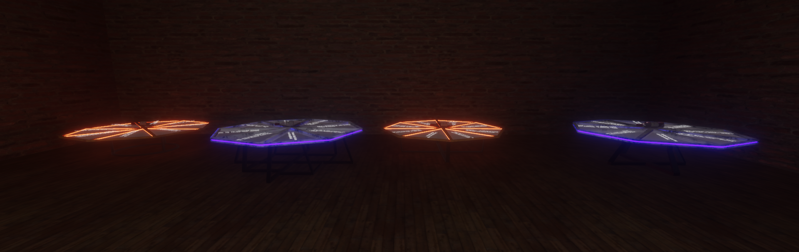
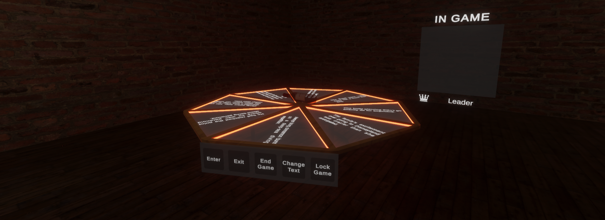

# VRC-SpinBottleGame

In this minigame players will spin the bottle that it will land in a random position, around the bottle there will be various sentences that are randomly selected from a vast list of sentences. When the bottle lands on a certain position the sentence and the player who spined the bottle will show up in a big display above the table, when another player spins the bottle again the last position where the bottle landed will change text to make it impossible to land on the same sentence twice.

The world to check the minigame can be found [here](https://vrchat.com/home/world/wrld_71147554-d41a-4738-8c28-3e76715fce84)

Available on [Booth](https://booth.pm/en/items/5844227) & [Jinxxy](https://jinxxy.com/CrZ3d/SpinBottleGame)

## Lite Version:

The lite version will work as explained in the start, not controlling which players are able to interact with the game, being that the big difference between the lite and standard version.

## Standard Version:

The standard version will work the same way as the lite version but it will have a small menu where the players will be able to enter, exit, end game, change text and lock the game.

The menu adds the funcionalaty of entering and exiting the game, so if you did not enter the game you will not be able to interact with it. The first player to enter the game will be the player boss and only that player will be able to end the game, change the text or lock the game. When a player enters and quits, the player board will update, that way it will always show the players in game and the name of the player boss in a separate section.

All the 3D models and textures were custom made by me and there will be:
- One bottle;
- 2 table bases;
- 4 table legs.

## Install instructions:

- Is required the latest version of the VRCSDK3 and UdonSharp.
- TextMmeshPro (If you do not have TMP it will ask you to install when draging the prefab)
- To add your own sentences to the game you need to click on the "UI" game object inside the prefab and in the inspector you will have to put a link in the "Sentences List Url", for that link you can use pastebin.The pastebin file is read line by line

## Terms of use:

You CAN use this minigame in any of your worlds.
You CAN'T send or sell this asset to others.
You only CAN use this asset in a world sold as a package if you purchase the distributable version instead of the other versions.

The Distributable version will have both the lite and standard version.

If you need any help or have any questions contact me on discord: crz__
